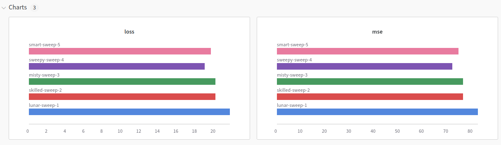

# 1

See `jurkfield.ipynb`

The following are excerpts from the notebook related to the questions, please refer to where they are found from the notebook for context.

## 1

##### processing

For data preprocessing, we simply draw from the CellCycle dataset provided. As G_1, G_2, S are all Interphase, for the purposes of this experiment we combined them into one class.
Since all the images in the dataset were of the same resolution and similar quality, no extra preprocessing was needed.


However, the classes are massively imbalanced. We have several strategies to combat this:
- Resampling
- Augmentation
- One-vs-All

We employed a random sampler for the train dataloader with weights given by (1/class_freq)^0.9. We also added some data augmentation, since one of the classes has only around 14 images (even less after splitting into train and validation).

##### architecture

###### convolution

Our convolutional network consists of an initial convolution followed by a maxpool of kernel size 2 which introduces some translational invariance. k=4 blocks follow. Each block starts with a (Bx)64xHxW convolution, followed by a batchnorm, ReLU and dropout. Finally a AdaptiveAvgPool2d squeeze every HxW feature map into 1x1, yielding a 64 x 1 x 1. This activation map is fed into an MLP, and the output is fed into a softmax to make predictions

An alternative approach could have been to have smaller convolutional layers but increase k, as that seems to be the more effective approach nowadays. 

###### vit

```python
vit_config = ViTConfig(
    img_size=sample_img.shape[-1],
    patch_size=16,
    n_classes=dt.classes,
    n_blks=3,
    emb_size=512,
    n_heads=8,
    hidden_size=2048,
    class_freqs=torch.tensor([count for _, count in dt.counts], dtype=torch.float32),
)
```

Our VIT features 3 blocks.

Each block consists of a a pre-layer norm (which was shown to be advantageous compared to post-layer norm), followed by a Multihead attention with 8 heads. We use an implementation that computes all 8 in parallel (refer to code). Then another layernorm followed by a MLP layer. We use GELU in the layer since there is evidence to suggest it performs better than RELU.

The rest of the architecture is standard ViT, basically, the image is broken into patches which are augmented with positional embeddings to form a sequence passed into the attention mechanism. The output of the attention is fed into a fully connected linear layer (with a pre-layer norm).

The bias of the linear layer is initialized with the log class frequencies as a way to ameliorate the class imbalance.

##### loss

as both are classification models, softmax is a good loss function. Due to the logsumexp trick, we only need to compute F.CrossEntropy on the logits (and associated predicitons), aiding in numerical stability.

## 2

As discussed above, the main issue of this experiment are the unbalanced classes. Special care must be taken to ensure that the model is actually learning to "seperate" the classes. The metrics discussed above can help us figure out whether this is the case.

Stochastic nature may help us avoid getting stuck in a "well" where the model just tries to always predict the same class. This can be done by decreasing the learning rate (or even decreasing the batch size).

Finally, we should also be sure to use a sufficiently complex model (i.e. enough layers), that the model can actually learn the difference. Especially 

It would be desirable to know whether our model actually learned to classify the images, and thus we may also want to, as a final step, perform some kind of projection like tsne/pca, or examine the final activations in the convolutional network to getter abetter feel for it.

From experimentation, I also found a low learning rate and (preferably balanced by high batch-size to increase speed) helped a lot too.

## 3

See ipynb.

In order to evaluate our performance, we need some metrics that represent the under-sampled classes.

- Balanced/macro versions of Accuracy/Recall/F1 work well.
- Additionally, ROC and kappa can also be illuminating for unbalanced datasets.

kappa is nice because it accounts for the chance agreement, and thus if it is >0, it shows our model is not just predicting the one imbalanced class.

One thing to note is that validation recall and accuracy were too close together so that one ended up obscuring the other, since I did not rebalance the validation set using a weightedrandomsampler, opting instead to experiment with balanced metrics. Possibly it may be a good idea to use a balanced validation set instead, but I opted to follow the example of existing studies on the dataset this time.

In the end, ViT and convolution (on the augmented dataset, with low learning rates and high batch size) performed similarly, at around 60% balanced accuracy on the validation set. The confusion matrices were also similar. 

## 4

CNN is better at hierarchical relationships, while ViT can kind of better attend to global context and long-range relationships. Since the task requires some detail:  classes Interphase and prophase look quite similar, I suspect that convolutions perform better for the task due to being better at feature detection (i.e. some specific characteristic of a border may be the differentiator of the two).

CNNs are efficient in terms of both memory and computation for image classification tasks because of the localized and shared weights across the image. They also perform well on smaller datasets.

ViTs can scale better with large datasets and complex tasks due to their ability to capture global dependencies. However, they are computationally more expensive and memory-intensive, especially as the image size increases.

Since our dataset is small, even with augmentation, possibly the VIT didn't have the chance to reach a full potential. Possibly a fine-tune may have even more success.

# 2

see `rnn.ipynb`

##### a

Our rnn unit uses 2 hidden layers of size 64. Since we are directly using the pytorch implementation, the architecture is standard. In brief, the process consists of the output of the unit being fed back into the unit `seq_len` times, corresponding to the RNN aiming to predict the next C6H6 value based on two days worth of data, after which the final hidden state (learned features) is fed into an fully connected layer to compute the desired value. The gated and lstm variants are similar, using gates to improve the retrieval of long-term dependencies as well as ameliorate vanishing/exploding gradients during training. The optimizer, AdamW, includes a weight decay of 1e-2, which is equivalent to L2 regularization (not so for Adam).

##### b

Refer to notebook.

We used a 6-fold split to test the model on its performance after withholding any two months of data. 

I was pretty surprised to see that for when the colder months were withheld, the validation loss had a pattern of remaining high for many epochs, up to as many as 80, before sharply dropping. In the end, the loss (MSE) was all around 10 after 100 epochs.
Due to compute time, I had to use a large batch size, which may have caused it to get stuck in a non-optimum minimum preventing loss from dropping further, in the future I'd like to retry after re-examining my data (as there was some issue between converting polars dataframes to tensors that disappeared after using pandas) as well as decrease batch size.

(Additionally, I also commented out the z-transform preprocessing on the dataset, to cotnrast with the given tutorial rnn. It seemed performance was similar.)

##### c

Since MSE is a pretty good indicator of the performance, it's possible to assess the performance directly based on the loss graphs. We see that the model was best able to infer the missing data when it was Early March to July.

##### d

See notebook. They seemed to be similar at around epoch 100, but gru was noticeably faster to improve, followed by lstm, then finally rnn.

# 3

wandb was used to perform bayesian search *at the end of rnn.ipynb*, but only one epoch was used to train, as a proof of concept since actually performing it would take too long. Plots were created with my handmade framework utilizing torcheval for metric computation instead.

